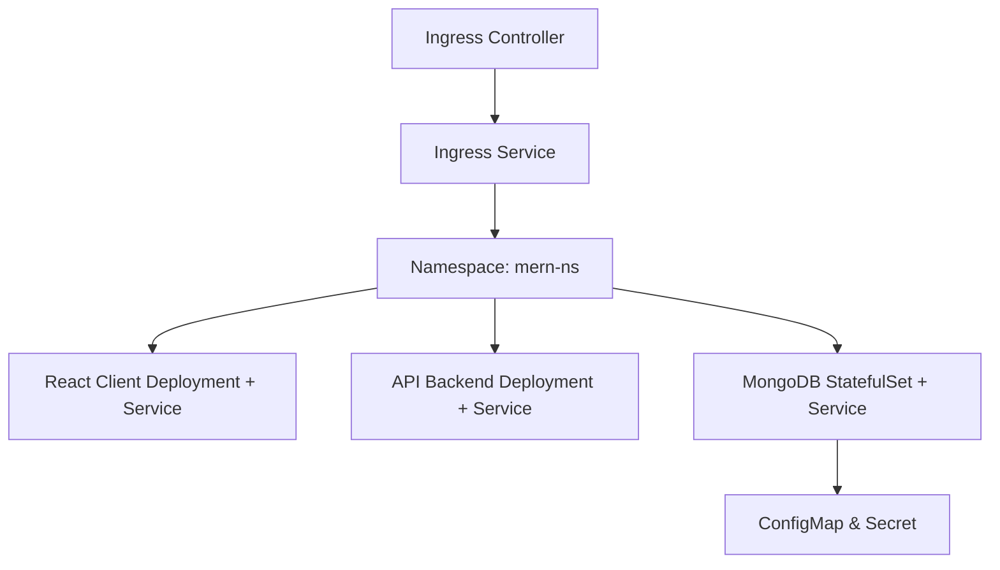

**K8S-NETWORKING**

```markdown
# 📦 MERN Stack App with Kubernetes Deployment (Docker Desktop Node)

This project is a **MERN stack application** (MongoDB, Express API, React Client, Node.js) containerized with Docker and orchestrated using **Kubernetes (k8s)** via Docker Desktop.

It demonstrates deploying a full-stack MERN app on Docker Desktop’s Kubernetes with Deployments, Services, Ingress, StatefulSets, and ConfigMaps.

---

## 📑 Project Structure

```

.

├── API-jokes/            # Backend Express API (Node.js)

├── react-client/         # Frontend React Application (Vite)

├── k8s/                  # Kubernetes deployment configurations

│   ├── backend/

│   ├── client/

│   ├── database/

│   ├── ingress/

│   └── namespace/

├── .gitignore

└── README.md

```

---

## 🚀 Features

- 📚 **Express API** for jokes management.
- 🎨 **React client** to consume and display jokes.
- 🍃 **MongoDB** deployed via StatefulSet for persistent storage.
- 🌐 **Ingress controller** for unified routing.
- 🗂️ **Namespace-based isolation** for organized resource management.
- 📦 Dockerized microservices architecture, deployable on Docker Desktop Kubernetes.

---

## 📊 Kubernetes Architecture Diagram



---

## 📦 Deployment Guide (Docker Desktop Kubernetes)

### 1️⃣ Prerequisites:

* [Docker Desktop](https://www.docker.com/products/docker-desktop) with Kubernetes enabled.
* [kubectl](https://kubernetes.io/docs/tasks/tools/)

---

### 2️⃣ Check Kubernetes is Running

Ensure Kubernetes is enabled in Docker Desktop → Settings → Kubernetes → Enable Kubernetes.

Then check:

```bash
kubectl cluster-info
```

---

### 3️⃣ Apply Namespace

```bash
kubectl apply -f k8s/namespace/mern-ns.yaml
```

---

### 4️⃣ Deploy MongoDB (Database)

```bash
kubectl apply -f k8s/database/
```

---

### 5️⃣ Deploy Backend API

```bash
kubectl apply -f k8s/backend/
```

---

### 6️⃣ Deploy React Client

```bash
kubectl apply -f k8s/client/
```

---

### 7️⃣ Set Up Ingress Controller and Service

```bash
kubectl apply -f k8s/ingress/
```

**Note:** If using Docker Desktop, an Ingress Controller might not be pre-installed. You can deploy NGINX Ingress using:

```bash
kubectl apply -f https://raw.githubusercontent.com/kubernetes/ingress-nginx/main/deploy/static/provider/cloud/deploy.yaml
```

Wait a few minutes, then check:

```bash
kubectl get pods -n ingress-nginx
```

---

### 8️⃣ Verify All Resources

```bash
kubectl get all -n mern-ns
```

---

### 9️⃣ Access the Application

If using a **NodePort** service:

* Find your NodePort:

```bash
kubectl get svc -n mern-ns
```

* Then access via:

```
http://localhost:<nodeport>
```

**Or**

If using  **Ingress with `localhost.nip.io` or custom host** :

* Add an entry in your local `hosts` file (optional)
* Or use `localhost.nip.io` which resolves to 127.0.0.1 automatically.

Example:

```
http://mern-app.localhost.nip.io/
```

---

## 📂 Folder Details

| Directory          | Description                                        |
| :----------------- | :------------------------------------------------- |
| `API-jokes/`     | Node.js Express API project with Docker support.   |
| `react-client/`  | React frontend project using Vite + Nginx Docker.  |
| `k8s/backend/`   | Backend deployment and service YAMLs.              |
| `k8s/client/`    | Client deployment and service YAMLs.               |
| `k8s/database/`  | MongoDB StatefulSet, service, configs and secrets. |
| `k8s/ingress/`   | Ingress controller and service configuration.      |
| `k8s/namespace/` | Kubernetes namespace definition.                   |

---

## 📌 License

This project is open-source and available under the [MIT License](https://chatgpt.com/c/LICENSE).

---

## 🙌 Author

**Muhammad**
